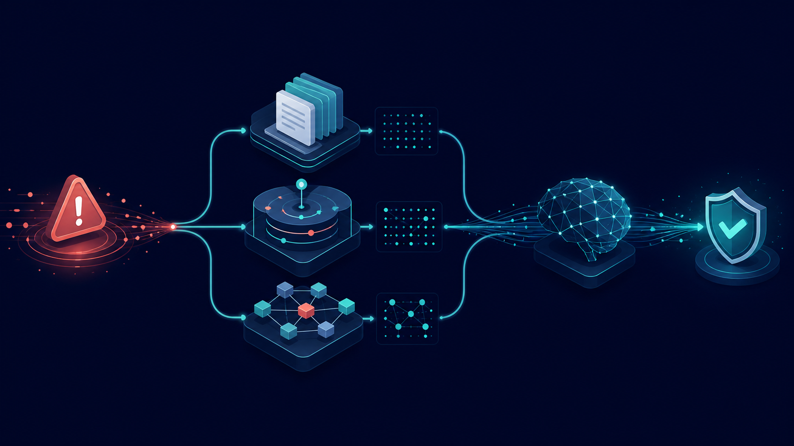
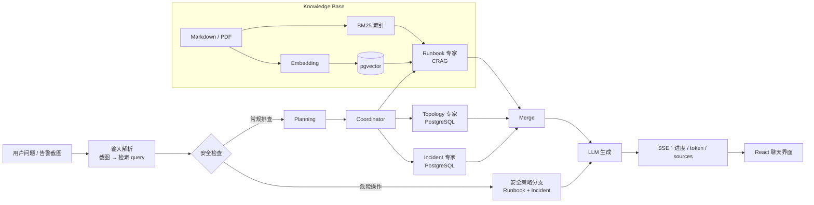

# ShipLog · 研发 On-call 故障排查助手

> 面向研发值班场景的 Agentic RAG：从 Runbook、事故复盘与服务拓扑中检索事实，再给出可追溯的排查建议；对危险操作明确提示审批边界。



<p align="center"><strong>Python 3.12 · FastAPI · LangGraph · pgvector · BM25/RRF · React 18 · SSE · Docker Compose</strong></p>

---

## 这是什么

On-call 值班时，工程师需要快速回答三件事：**先查什么、以前是否发生过、还会影响谁**。但 Runbook、事故复盘和服务依赖通常分散在不同位置；普通 RAG 容易检索不准，模型还可能补出文档里不存在的危险命令。

ShipLog 用可演示、可评测的模拟 SRE 知识库验证这条链路：

```text
告警/问题 → 混合检索 → CRAG 相关性控制 → 多工具 Agent → 安全生成 → 来源与 trace 回放
```

> [!IMPORTANT]
> 本项目的 Runbook、事故记录与服务拓扑均为**模拟数据**，用于学习和验证 RAG/Agent 工程能力；不包含任何公司生产文档或真实事故数据。

## 能做什么

| 场景 | ShipLog 的做法 |
|---|---|
| “Redis 超时先查什么？” | 检索 Runbook，按文档事实生成步骤、命令与预期输出 |
| “上周类似 OOM 怎么发生的？” | 查询 PostgreSQL 中的模拟事故记录，并作为背景信息汇总 |
| “payment-service 挂了还影响谁？” | 查询服务依赖拓扑，回答上下游与 blast radius |
| “能直接 FLUSHALL 吗？” | 命中安全分支：说明风险、依据、审批与替代方案，不给危险命令 |
| 贴一张告警截图 | 视觉模型先提取服务、错误码和指标，再走文本 RAG 检索 |

## 架构



### 关键设计

1. **混合检索**：向量检索负责语义相近，BM25 负责错误码、服务名、`kubectl` 等精确词；通过加权 RRF 融合。
2. **CRAG**：先让 LLM 判断检索片段是否相关；不相关时最多改写一次 query，再决定谨慎生成或拒答。
3. **Multi-Agent**：协调器只派发 Runbook、Incident、Topology 三个受控工具，不是多个 Agent 自由对话。
4. **安全分支**：`FLUSHALL`、删库等高风险问题不走常规流程，强制输出风险、审批与替代方案。
5. **可观测性**：每轮生成 `trace_id`；前端通过 SSE 显示规划、工具调用、逐 token 回复和来源。

## 可验证的结果

评测脚本与原始报告都保留在仓库中，而不是只写结论。

| 层级 | 方法 / 数据集 | 结果 | 说明 |
|---|---|---:|---|
| 检索 | ShipLog 38 道计分题，Top-3 | Recall@3 **86.8%** | 10 篇模拟 KB、44 个向量块的基线 |
| 检索 | 扩库到 148 个向量块，RRF | Recall@3 **86.8%** / MRR **0.829** | 噪声增加后排序更难 |
| 重排 | RRF + `bge-reranker-base` | Recall@3 **84.2%** | 同库未提升，保留为可开关实验能力 |
| 生成 | CRAG + On-call prompt，33 题 × 3 组 | 幻觉率 **17.2% → 11.5%** | 代价是误拒答率 **12.1% → 21.2%** |

详细口径、分母和逐题报告见 [评测基线](./eval/reports/BASELINE.md)。这里的“faithfulness”是项目自定义的**答案级** LLM-as-judge 口径，并非官方 RAGAS 指标。

## 快速开始

### 1. 准备环境

- Python 3.12
- [uv](https://docs.astral.sh/uv/)
- Node.js 18+
- Docker Desktop（推荐，用于 PostgreSQL + pgvector 与完整部署）

```powershell
copy .env.example .env
# 在 .env 中填写 DEEPSEEK_API_KEY
```

如需用截图提问，还需配置 DashScope 或兼容的视觉模型密钥，见 `.env.example` 中的 `DASHSCOPE_API_KEY` / `VISION_*` 说明。

### 2. Docker 一键启动（推荐）

```powershell
docker compose up -d --build
```

打开 <http://127.0.0.1:5173>，前端经 nginx 同源代理访问后端；调试后端接口可访问 <http://127.0.0.1:8032/docs>。

### 3. 导入模拟知识库

```powershell
uv run python scripts/import_docs.py
```

该命令会把 `docs/kb/**/*.md` 切块，写入 pgvector 并同步 BM25 索引。

### 4. 本地开发（两个终端）

```powershell
# 终端 1：FastAPI
.\scripts\dev.ps1

# 终端 2：Vite
.\scripts\dev-frontend.ps1
```

前端地址为 <http://127.0.0.1:5173>，后端 Swagger 为 <http://127.0.0.1:8000/docs>。

## Rerank 开关

CrossEncoder 重排默认关闭，避免首次请求下载模型并增加 CPU 延迟。若想实验“RRF 粗排 → CrossEncoder 精排”，在 `.env` 加入：

```ini
RERANK_ENABLED=1
# 可选，默认值如下
RERANK_MODEL=BAAI/bge-reranker-base
RERANK_POOL=20
```

然后重启后端。请同时运行评测确认它对当前知识库是否真的有正收益；本仓已有一次对照结果显示它并未提升 Recall。

## API

| 接口 | 作用 |
|---|---|
| `POST /chat` | 非流式对话，返回 JSON |
| `POST /chat/stream` | SSE 流式对话，推送进度、token、sources 与 trace |
| `POST /documents/upload` | 上传单个 PDF / Markdown 并增量入库 |
| `GET /documents/stats` | 查询向量库和 BM25 索引统计 |
| `GET /traces/{trace_id}` | 回放一次请求的检索、派单与生成前步骤 |

`POST /chat/stream` 的事件约定、前端 buffer 解析和 Queue/ContextVar 的实时工具进度实现，见 [SSE 客户端笔记](./docs/codeLearning/frontend/sse-client.md)。

## 评测

```powershell
# 混合检索：Recall@K / Precision@K / MRR
uv run python eval/run_eval.py

# 仅向量检索对照
uv run python eval/run_eval.py --dense-only

# 显式开启 CrossEncoder 的检索对照
uv run python eval/run_eval.py --rerank

# 生成层：无 CRAG / 有 CRAG 与不同 prompt 的对照
uv run python eval/run_gen_eval.py
```

生成层评测会调用 LLM，耗时更长且产生 API 成本；检索层评测不调用 LLM。

## 项目结构

```text
app/
├── rag/                 # 检索、CRAG、多 Agent、会话、trace、视觉输入
├── tools.py             # Runbook / Incident / Topology 三个受控工具
├── llm.py               # DeepSeek 与视觉模型封装
└── config.py            # 环境变量与模型配置
frontend/src/
├── components/          # 对话、知识库上传界面
└── api/                 # chat / SSE / health / documents 客户端
docs/kb/                 # 模拟 Runbook、事故复盘、架构与 demo 文档
eval/                    # 题集、评测脚本、可复查报告
```

## 设计取舍与下一步

- **安全优先于可用性**：CRAG 会降低幻觉，但也会提高误拒答；`soft-fallback` 是为降低误拒答引入的可配置折中，仍需全量复测。
- **Rerank 不盲开**：实现了二阶段重排，但将指标优先于“功能看起来更多”；对当前小型库，历史对照并未提升 Recall。
- **模拟数据不等于生产可用**：真实部署还需要认证、权限、审计、限流、知识库版本管理和真实事故数据治理。

后续方向与面试口述可分别查看 [项目场景](./docs/scenario/SCENARIO.md)、[三分钟 Pitch](./docs/PITCH.md) 和 [M6 实施记录](./docs/steps/M6-steps.md)。

---

如果这个项目对你有帮助，欢迎 Star；也欢迎用 issue 讨论 RAG 评测、On-call 安全边界或 Agent 编排的改进思路。
