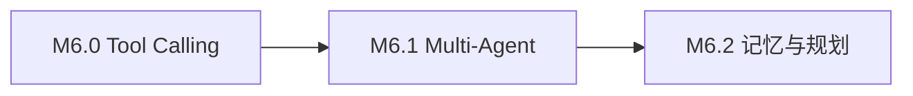

# M6 分步指南：ShipLog Agent 演进（M5 完成后可选）

> 前置：M5 全部完成（Docker + pgvector + **ShipLog 场景** + README + 面试自测）。  
> 目标：在 **ShipLog On-call** 场景上演进 Agent，不另起项目。  
> M4/M5 的 CRAG 仍负责**检索质量**；M6 负责**多工具、多步排查**。

---

## 总览



| 子步 | 做什么 | ShipLog 语境 | 场景题重点 |
|------|--------|--------------|-----------|
| M6.0 | Tool Calling | Runbook 检索 + 历史 incident SQL +（可选）外部搜索 | 「什么时候查 Runbook vs 查事故库」 |
| M6.1 | Multi-Agent 分工 | Runbook Agent / Incident Agent /（可选）External Agent | 「多路结果冲突怎么汇总」 |
| M6.2 | 会话记忆 + 多步规划 | On-call 多轮上下文 + 排查步骤列表 | 「会话记忆和 Runbook 知识库区别」 |

---

## M6.0 Tool Calling：On-call 三工具

**目标**：LLM 根据问题自主选工具——查 Runbook、查历史故障、或（可选）查外部状态。

### 工具定义（`app/tools.py`）

| 工具 | 作用 | 对应 M5 能力 |
|------|------|--------------|
| `search_runbook` | 混合检索 `docs/kb/` 已向量化内容 | M4.3 RRF + M5.2 kb |
| `query_incident` | SQL 查 PG `incidents` 表（类似故障、时间范围） | M5.1 PG |
| `web_search`（**可选**） | Tavily/Brave 查外部公告、CVE | 新增 API |

> **与旧版 M6 规划的关系**：原「RAG + 联网 + SQL」保留；RAG 改名为 `search_runbook`，SQL 从 trace 表改为 **incidents 业务表**，更贴 ShipLog 叙事。

### `incidents` 表（M6.0 新增 seed）

```text
incidents：
  - id, title, service, severity, root_cause, resolved_at, summary, …
```

- seed 3～5 条与 `docs/kb/postmortems/` 一致的虚构数据
- 面试题：「上周有没有类似 Redis 超时？」→ `query_incident`

### 要做的事

- `tools.py`：上述工具 + Pydantic 参数校验 + JSON 解析兜底（重试 1 次）
- `graph.py`：LangGraph tool calling 节点（LLM → tool_calls → 执行 → 回传 → 生成）
- `main.py`：可选 `/chat/agent` 或在现有 `/chat/stream` 加 agent 模式
- 前端：SSE 事件 `tool_start` / `tool_end`（「正在查询 Runbook…」）

### 验收

- 「Redis 超时第一步？」→ `search_runbook`
- 「上个月 OOM 出过吗？」→ `query_incident`
- （可选）「AWS us-east-1 今天挂了吗？」→ `web_search`
- trace 可回放选了哪个 tool

### 场景题

「怎么保证 JSON tool 调用稳定？选错 tool 怎么办？」（见 [interview/analysis/project-mapping.md](./interview/analysis/project-mapping.md) §4.5）

---

## M6.1 Multi-Agent：On-call 分工

**目标**：复杂故障由协调 Agent 拆分——查 Runbook、查历史、（可选）查外部。

### Agent 分工

| Agent | 职责 |
|-------|------|
| **协调 Agent** | 解析告警描述 → 分配子任务 → 汇总 |
| **Runbook Agent** | RAG + BM25 混合检索 |
| **Incident Agent** | `query_incident` + 复盘摘要 |
| **External Agent**（可选） | 联网搜索云厂商状态页 |

### LangGraph 安全分支（贴面经）

- 检测到「生产破坏性操作」（如 FLUSHALL、删库）→ **强制走 safe_response 节点**，只引用 Runbook 禁止条款
- 对应美团面经「高风险场景怎么控对话」——用 ShipLog 语境答，非心理咨询场景

### 验收

- 「对比 Runbook 建议和上次 incident 处理是否一致」→ 协调 Agent 调两路 → 汇总
- 危险操作请求 → 拒答或只给 Runbook 只读步骤

### 场景题

「Multi-Agent 结果冲突怎么办？」「LangGraph 怎么防止 unsuitable 操作？」

---

## M6.2 On-call 记忆与多步规划

**目标**：多轮 On-call 对话 + 复杂故障分步排查。

### 要做的事

- LangGraph **checkpointer**：会话内记住「刚才那个 Redis 实例」
- **Planning node**：复杂问题拆步（例如：1. 确认症状 2. 查 Runbook 3. 查历史 incident 4. 给结论）
- 前端：步骤列表 / 思考过程（可与 M5.4 截图链路共用 SSE 事件类型）

### 记忆分层（口述 + 轻量实现）

| 类型 | 存哪 | 例子 |
|------|------|------|
| **短期** | checkpointer / session 表 | 本轮对话 raw history |
| **长期（可选）** | PG 摘要 | 值班工程师偏好、常问服务（M6.2 可只做短期） |

> Runbook **知识库**（RAG）≠ **会话记忆**（checkpointer）——面试必区分。

### 验收

- 多轮：「刚才那个告警」能指代上一轮 Redis 问题
- 复杂题能输出 2～4 步排查计划并逐步执行

### 场景题

「Agent 记忆和 RAG 知识库区别？」「不微调怎么做 bad case 回流？」（指 eval 扩展，见 [interview/upgrades/backlog.md](./interview/upgrades/backlog.md) U-007）

---

## 简历叙事（M6 完成后）

> **ShipLog** 研发 On-call 助手：M2 纯 RAG → M4 Agentic RAG（CRAG + 混合检索）→ M5 pgvector + Runbook 知识库 + **截图思路 A** → M6 Tool Calling（Runbook + 历史 incident）→ Multi-Agent 分工。  
> 同一项目逐步演进，核心链路自研。

---

## 与 M5.4 截图（思路 A）的衔接

| 能力 | M5.4 | M6 |
|------|-------|-----|
| `app/rag/vision.py` DeepSeek V4 读图 → query | ✅ 实现 | **复用**，不另写 |
| 文本混合检索 + CRAG | ✅ | 封装进 `search_runbook` tool |
| SSE「正在分析截图…」 | 可选简单文案 | 规范为 `vision_extract` / `tool_start` 事件 |
| 贴图 + 选 tool 多步 | ❌ | M6.0 编排（如先读图再 `query_incident`） |

M6 **不实现** CLIP 图文混合检索（完整端到端多模态 → backlog U-009）。

---

## 不做 / 延后（避免 scope 膨胀）

| 项 | 说明 |
|----|------|
| 多模态向量库（CLIP / 端到端） | backlog U-009；**M5.4 已定稿思路 A**（DeepSeek 读图→文本 RAG） |
| MCP 协议 | backlog U-005；LangChain `@tool` 够用 |
| 工业 PDF 跨页表格 | 非 ShipLog 主轴 |

---

## 下一步

M5 全部完成后，说 **「继续 M6.0」** 开始 ShipLog Tool Calling。
