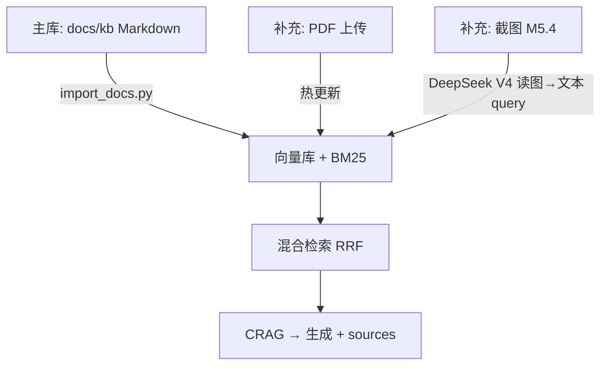

# 项目场景：ShipLog 研发 On-call 故障排查助手

> 本文档是项目的**业务场景 + 对标 GitHub + 里程碑**权威说明。  
> 面试题见 [qa-scenario-guide.md](./qa-scenario-guide.md) · 面经映射见 [interview/analysis/project-mapping.md](./interview/analysis/project-mapping.md)。

---

## 0. 场景演进（与历史里程碑的关系）

| 阶段 | 场景 | 状态 |
|------|------|------|
| M0～M3 | 通用 RAG + 全栈 | ✅ 已完成 |
| **M4** | **DevKit** — 索引本仓库 `docs/*.md`，验证 Agentic RAG 工程能力 | ✅ 已完成（代码能力保留） |
| **M5.2 起** | **ShipLog** — 模拟 On-call Runbook / 事故复盘问答 | 📍 **当前定稿方向** |
| **M6** | ShipLog + Tool Calling（Runbook + incident SQL + 可选搜索） | 可选 |

**不冲突原则**：M4 的混合检索、CRAG、eval、trace **原样复用**；M5.2 只换**知识库内容、prompt、UI 文案、eval 题**，不重写 RAG 引擎。

---

## 1. 项目定位

### 之前（M4 · DevKit）

> 研发团队内部文档助手 — 帮新人查 PLAN、分步指南、qa 卡。

问题：能证明工程能力，但**业务叙事偏 meta**，和大量「知识库 Demo」同质，面经「拷打项目」时不够像真实业务。

### 现在（M5.2 起 · ShipLog）

> **ShipLog — 研发 On-call 故障排查助手**  
> **服务对象**：值班工程师 / SRE  
> **知识来源**：模拟 Runbook、事故复盘（Postmortem）、服务架构说明（`docs/kb/`）  
> **核心痛点**：P0 时文档散、搜不到告警码/命令、胡编操作有风险  

对标 [onyx-dot-app/onyx](https://github.com/onyx-dot-app/onyx) 的企业搜索形态，场景换成 **SRE On-call**（更贴美团/字节 Agent 面经）。

---

## 2. 用户故事

| 用户 | 场景 | 期望 |
|------|------|------|
| On-call 工程师 | 「Redis 连接超时，第一步查什么？」 | 引用 Runbook，给出可执行检查步骤 |
| On-call 工程师 | 「上周类似 OOM 怎么修的？」 | 引用 Postmortem +（M6）查 incident 表 |
| 面试官 | 「召回率多少？」 | ShipLog eval 20 题 **Recall@3** 数字 |
| 面试官 | 「能不能 FLUSHALL？」 | CRAG + prompt **拒答/只读 Runbook 禁止项** |
| 演示观众 | 上传厂商 PDF / 贴告警截图 | M5.4 补充路径，主库仍用 Markdown kb |

---

## 3. 知识库策略



| 路径 | 角色 | 是否必须 |
|------|------|----------|
| `docs/kb/**/*.md` | 主知识库，eval 依据 | ✅ M5.2 |
| PDF 上传 | 模拟临时厂商手册 | M5.4 |
| 联网搜索 | 外部实时状态 | M6 可选 tool |
| 用户截图 | 告警图 → **DeepSeek V4 思路 A** → 文本 RAG | M5.4 |

### 目录规划（M5.2 创建）

```text
docs/kb/
├── architecture/       # 服务拓扑、On-call 流程
├── runbooks/           # Redis、K8s OOM、502、磁盘、回滚…
└── postmortems/        # 虚构事故复盘
```

- 内容为**模拟场景**（参考公开 SRE 实践改写），简历/面试如实说明  
- **不**使用真实公司内部 PDF/文档  

---

## 4. 技术亮点（已有 + 规划）

| 能力 | 里程碑 | 面试讲点 |
|------|--------|----------|
| 混合检索 BM25+向量 RRF | M4.3 ✅ | 告警码、`kubectl` 命令精确匹配 |
| LangGraph CRAG | M4.2 ✅ | 低相关拒答，防胡编操作 |
| eval Recall@3 | M4.1 ✅ | M5.2 换 ShipLog 题重跑 |
| trace_id 回放 | M4.4 ✅ | Bad case 复盘 |
| Docker + pgvector | M5.0～M5.1 | 生产叙事 |
| PDF 热更新 + 截图提问（思路 A） | M5.4 | 热更新 + DeepSeek 读图→文本检索 |
| Tool Calling | M6.0 | Runbook vs incident SQL |
| Multi-Agent | M6.1 | 多路排查汇总 |

---

## 5. 对标 GitHub（不变）

| Stars | 项目 | 我们摘什么 |
|------:|------|-----------|
| **148k** | [langgenius/dify](https://github.com/langgenius/dify) | 产品形态 checklist |
| **30k** | [onyx-dot-app/onyx](https://github.com/onyx-dot-app/onyx) | 企业搜索叙事 |
| **3.6k** | [agentic-rag-for-dummies](https://github.com/GiovanniPasq/agentic-rag-for-dummies) | M4.2 CRAG |
| **92** | [CliffsCai/Rag_System](https://github.com/CliffsCai/Rag_System) | M4.3 混合检索 |

---

## 6. 评估指标（M5.2 换题后重跑）

| 指标 | 含义 | 说明 |
|------|------|------|
| **Recall@3** | Top-3 含正确 Runbook/Postmortem | 主数字，写入 `eval/BASELINE.md` |
| **拒答准确率** | 库外/危险操作是否拒答 | ≥5 道拒答题 |
| **Faithfulness** | 回答是否 grounded | M5.2 人工；后续可 RAGAS（backlog U-002） |

PDF/截图 demo 题：**手测**，不进主 eval 20 题。

---

## 7. 简历一句话（M5.3 定稿）

> **ShipLog** 研发 On-call 助手：LangGraph Agentic RAG 索引模拟 Runbook/Postmortem；BM25+向量混合检索；CRAG 低置信拒答防误操作；自建 20 题 eval Recall@3 XX%；pgvector + trace 可复盘；FastAPI + React + Docker。核心链路自研，参考 Dify/Onyx 场景。

---

## 8. 里程碑对照

| 子步 | ShipLog 相关交付 |
|------|------------------|
| M5.1 | PG 向量 + trace（场景无关） |
| **M5.2** | **kb 内容 + import + prompt + eval + UI** |
| M5.3 | README + PITCH |
| M5.4 | **PDF 热更新 + 截图提问**（`vision.py` · 思路 A） |
| M5.5 | 场景面试 20 题 |
| M6.0 | search_runbook + query_incident |
| M6.1 | Multi-Agent + 安全分支 |
| M6.2 | On-call 多轮记忆 |

详见 [M5-steps.md](./M5-steps.md) · [M6-steps.md](./M6-steps.md)

---

## 9. 当前行动项

- [x] 场景方向确认：**方案 A ShipLog**（2026-07-29）
- [ ] **继续 M5.1** pgvector + trace
- [ ] **继续 M5.2** 创建 `docs/kb/` + 场景换皮

---

## 10. 参考

- [美团 Agent 面经映射](./interview/analysis/project-mapping.md)
- [升级 backlog](./interview/upgrades/backlog.md)
- [qa-scenario-guide.md](./qa-scenario-guide.md)
