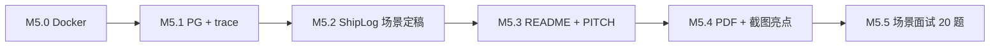
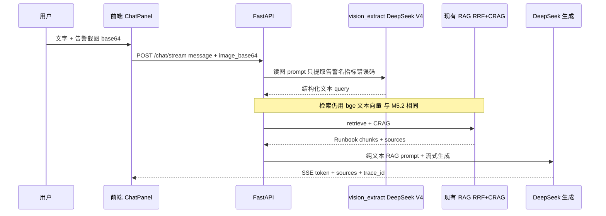

# M5 分步指南：简历交付 + ShipLog 场景 + 生产化收尾

> 前置：M4 全部完成（含 M4.4 trace_id）。  
> **业务场景**：M4 阶段为 DevKit 文档助手；**M5.2 起切换为 ShipLog On-call 助手**（见 [SCENARIO.md](./SCENARIO.md)）。  
> 场景面试题见 [qa-scenario-guide.md](../qa/qa-scenario-guide.md)。

**当前进度：M5.2 已验收通过（ShipLog 场景定稿 + 量化评估增强，Recall@3=86.8%、幻觉率 17.2%→11.5%、43题含不覆盖场景）**

---

## 总览



| 子步 | 做什么 | 改动范围 | 场景题重点 |
|------|--------|----------|-----------|
| M5.0 | Docker 一键启动（后端+前端，**仍用 Chroma**） | `Dockerfile`、`docker-compose.yml` | 「怎么部署演示」 |
| M5.1 | **Chroma → pgvector** + **trace 迁 PG** | `store.py`、`trace.py`、Compose 加 Postgres | 「为什么上 pgvector / trace 表怎么查」 |
| M5.2 | **ShipLog 场景定稿**：kb 知识库 + eval + prompt/UI | `docs/kb/`、`import_docs.py`、prompt、前端文案 | 「On-call 为什么不能胡编命令」 |
| M5.3 | README 简历化 + 3 分钟介绍稿 | `README.md`、`docs/PITCH.md` | 「用 3 分钟介绍 ShipLog」 |
| M5.4 | **On-call 输入亮点**：PDF 热更新 + **截图→文本→RAG（DeepSeek V4）** | 上传、`vision.py`、`llm.py`、ChatPanel | 「贴告警图怎么处理 / 为何不做端到端多模态」 |
| M5.5 | 模拟面试 20 题验收 | [qa-scenario-guide.md](../qa/qa-scenario-guide.md) | 场景题 ≥15/20 |

> **约定**  
> - **M5.0～M5.1**：技术栈收尾（Docker、PG），**不改业务场景**。  
> - **M5.2**：场景换皮；RAG 核心（检索、CRAG、RRF）**不重写**。  
> - **M5.4**：On-call 输入亮点（**PDF 热更新 + 截图思路 A** 同一步完成）；DeepSeek V4 读图，不另购 Vision API；主 eval 仍以 M5.2 Markdown kb 为准。  
> - 原早期规划「M5.2 README、M5.3 面试」已顺延为 **M5.3 / M5.5**，**不与 M4 子步编号冲突**。

---

## M5.0 Docker Compose

**目标**：他人 `docker compose up` 能跑通上传 + 聊天 + eval（Chroma 数据卷挂载）。

### 要做的事

- 后端 `Dockerfile`（uv + `main.py`）
- `frontend/Dockerfile` + nginx 静态托管（`VITE_API_BASE_URL=http://localhost:8032`）
- `docker-compose.yml`：backend、frontend；挂载 `data/chroma`、`data/bm25`、`data/traces`
- `.env.example` 说明 `DEEPSEEK_API_KEY` 与 Docker 启动步骤

### 快速命令

```powershell
copy .env.example .env
# 编辑 .env 填入 DEEPSEEK_API_KEY
docker compose up --build
# 另开终端：首次入库（M5.2 后改为导入 docs/kb/）
docker compose exec backend uv run python scripts/import_docs.py
```

浏览器：http://localhost:5173 · API：http://localhost:8032/health

### 验收

- 新机器仅依赖 **Docker Desktop** + `.env` 能打开 UI 并 RAG 问答
- `GET /documents/stats` 正常

### 场景题

「本地开发和 Docker 部署差在哪？数据卷怎么挂？」

---

## M5.1 PostgreSQL：pgvector + trace

**目标**：向量与 trace 日志都进 **PostgreSQL**；**不大改**检索/CRAG/前端；BM25 仍用 `corpus.json`。

### 范围

| 要改 | 不改 |
|------|------|
| `app/rag/store.py`（`get_vector_store` → PGVector） | `retriever.py`（仍 `similarity_search`） |
| `app/rag/trace.py`（JSONL → PG 表，`trace_id` 索引） | `graph.py` / CRAG 流程 |
| `docker-compose.yml` 增加 **postgres** + pgvector 初始化 | 混合检索 RRF 逻辑 |
| `pyproject.toml` PG 依赖；`.env`：`DATABASE_URL` | 前端 |
| `GET /traces/{id}` 改为查 PG | 聊天历史 / users 表（**本步不做**） |

### PG 里存什么

```text
document_chunks（pgvector）：
  - page_content, embedding, metadata（source、chunk_id）

rag_traces：
  - trace_id（唯一索引）, question, steps（JSONB）, created_at, route, …
```

**不进 PG（本步）**：BM25 语料（仍 `data/bm25/corpus.json`）、chat 历史、users、incidents 表（**M6.0 再加**）。

### 验收

- `eval/run_eval.py` Recall@3 与 M4.3 Chroma 版 **持平**（记入 `eval/BASELINE.md`）
- `GET /traces/{trace_id}` 从 PG 回放，中文 question 正常
- `vector_count` / stats 接口仍可用

### 场景题

「为什么从 Chroma 迁到 pgvector？trace 为什么也进 PG？BM25 为什么还放 JSON？」

---

## M5.2 ShipLog 场景定稿（核心换皮）

**目标**：业务从 DevKit「查本仓库文档」→ **ShipLog「On-call 查 Runbook / 事故复盘」**；引擎不变，换知识库与叙事。

### 知识库结构（新建内容，非代码）

```text
docs/kb/
├── architecture/     # 服务拓扑、On-call 流程（1～2 篇）
├── runbooks/         # Redis 超时、Pod OOM、502、回滚等（5～6 篇）
└── postmortems/      # 虚构事故复盘（3～4 篇）
```

- 内容为**模拟场景**（参考公开 SRE 实践改写），非真实公司内部文档
- 主路径：`import_docs.py` 批量入库；**不依赖**用户上传才能 demo

### 代码改动（小）

| 文件 | 改动 |
|------|------|
| `scripts/import_docs.py` | 扫描 `docs/kb/**/*.md`，**不**索引 `docs/PLAN.md` 等学习文档 |
| `app/rag/context.py` | Runbook 助手 prompt；强调**禁止编造 shell 命令** |
| `app/rag/graph.py` | `REWRITE_PROMPT` 改为 Runbook/Postmortem 语境 |
| `frontend/.../ChatPanel.tsx` | 标题 + 示例问题（如「Redis 超时第一步查什么？」） |
| `frontend/src/App.tsx` | 首页 ShipLog 文案 |
| `eval/questions.json` | **20 题重写**，`expected_sources` 指向 kb 文件 |

**不改**：`retriever.py`、`store.py`、`bm25_index.py`、`rag.py` 主链路。

### 验收

- `import_docs.py` 后问 Runbook 题 → 回答带正确 `sources`
- `eval/run_eval.py` 输出 ShipLog 版 Recall@3（记入 `eval/BASELINE.md` 新小节）
- CRAG 对「能否高峰 FLUSHALL」类危险题能拒答
- Docker 一键启动 + import 后可 demo

### 场景题

「混合检索为什么适合 Runbook（告警码、Pod 名、命令）？」「答错了怎么四层排查？」

---

## M5.3 README 简历化 + PITCH

**目标**：GitHub 首页当简历项目；3 分钟 STAR 讲 ShipLog。

### 要做的事

- 更新 [SCENARIO.md](./SCENARIO.md)（ShipLog 定稿版）
- README：场景、架构图、技术栈、Docker/PG 启动、**ShipLog eval 数字**
- `docs/PITCH.md`：背景（P0 查 Runbook 慢）→ 方案 → 指标 → 难点（混合检索、CRAG 拒答）
- 链到 `eval/BASELINE.md`、`docs/interview/analysis/project-mapping.md`

### 验收

- 外人只看 README 知道 ShipLog 解决什么问题、怎么跑
- 你能不看稿讲完：kb 入库 → 混合检索 → CRAG → trace → 流式

### 场景题

「用 3 分钟介绍你的 RAG 项目。」（按 ShipLog 叙事，不说 DevKit）

---

## M5.4 On-call 输入亮点（PDF 热更新 + 截图提问 · 思路 A）

**目标**：演示真实 On-call 的两种补充输入——**临时 PDF 手册**与**告警截图**，均 **补充** M5.2 主库，不替代 eval 主路径。

> **不是端到端多模态 RAG**：图片**不进**向量库；embedding 仍用 bge 文本模型；检索 / CRAG / pgvector **不改**。

### 本步包含两块交付（一次 M5.4 做完，可一个或两个 commit）

#### 1）PDF 热更新

- 准备 1～2 份**自写/改写** PDF（如《Redis 6.x 升级手册》），非真实内部文档
- 沿用现有 `POST /upload` + `loader.py` PDF 切块
- Demo：先问 Runbook Markdown 题 → 上传 PDF → 再问 PDF 内专有细节 → `sources` 出现 `.pdf`
- 样例放 `docs/kb/samples/`；上传能力 M2 已有，**可无代码改动**

#### 2）截图提问 · 思路 A（DeepSeek V4）

**数据流**：



| 层 | 文件 / 配置 | 改动 |
|----|-------------|------|
| 配置 | `.env.example` | `LLM_MODEL=deepseek-v4-flash`（或 `-pro`）支持 `image_url`；**无需**第二家 Vision API |
| 后端 | `app/schemas.py` | `ChatRequest` 增加可选 `image_base64` |
| 后端 | `app/rag/vision.py`（**新建**） | `extract_query_from_image(text, image_b64) -> str` |
| 后端 | `app/llm.py` | 多模态 `HumanMessage(content=[text, image_url])` |
| 后端 | `app/rag/rag.py`、`graph.py` | 有图时先 `vision.extract` 再 retrieve |
| 后端 | `main.py` | `/chat`、`/chat/stream` 透传 `image_base64` |
| 前端 | `ChatPanel.tsx` | 贴图预览、base64 上传；可选展示「已从截图识别：…」 |
| 样例 | `docs/kb/demo/` | 虚构告警截图 + `demo-screenshot.md` 手测步骤 |
| 文档 | README / PITCH | 「输入多模态 + 文本 RAG」；对比端到端多模态（扩展方向） |

**读图 prompt 要点**：只输出告警名、服务名、指标、错误码；不编造 Runbook 步骤；允许仅发图无文字。

### 与 M6 的分工

| 能力 | M5.4 | M6 |
|------|------|-----|
| 读图 → 文本 query | ✅ `vision.py` | 复用 |
| 文本混合检索 | ✅ | `search_runbook` tool |
| SSE「正在读图…」 | 可选 | `tool_start` 事件 |
| 查 incident SQL | ❌ | M6.0 |

### 验收

- **PDF**：上传后能检索到 PDF 来源 chunk
- **截图**：贴 Redis 告警图 + 提问 → 命中 `runbooks/redis-*.md`；仅发图也能答；`trace_id` 含 `vision_extract` 步骤
- **eval**：截图 **2～3 道手测**，写进 `docs/kb/demo/`；**不进**主 `eval/questions.json` 20 题

### 实施前自检

```powershell
# 确认 DeepSeek API 接受 image_url
# LLM_MODEL=deepseek-v4-flash 或 deepseek-v4-pro
```

### 场景题

「Runbook 怎么热更新？」「用户只发截图你怎么处理？」「为什么不做 CLIP 图文混合检索？」

---

## M5.5 场景面试 20 题

**目标**：按 [qa-scenario-guide.md](../qa/qa-scenario-guide.md) + [interview/analysis/project-mapping.md](../interview/analysis/project-mapping.md) 自测。

### 要做的事

- 更新 `docs/qa/qa-m5.md`（ShipLog 场景题）
- 模拟追问：Retrieve miss、混合检索、CRAG 拒答、Docker/PG、trace、PDF/截图亮点
- 对照美团 Agent 面经 [interview/sources/meituan/](./interview/sources/meituan/) 练 🟢 题

### 验收

- 自测 **≥15/20** 题达到「现象 → 根因 → 排查 → 更好方案」
- 能白板画：用户问 → 检索 → CRAG → 生成 + trace

### 场景题

「模拟美团/腾讯 RAG 面」——从 qa-scenario-guide + 面经库抽题。

---

## 环境：要装什么？

| 软件 | M5.0～M5.3 | M5.4 | 说明 |
|------|------------|------|------|
| **Docker Desktop** | ✅ 必须 | ✅ | Compose 含 Postgres（M5.1 起） |
| **PostgreSQL 安装包** | ❌ | ❌ | PG 在容器内 |
| **Vision API Key** | ❌ | ❌ | M5.4 截图用 **DeepSeek V4 同一 Key** |

---

## 与 M6 的衔接

| M5 完成项 | M6 怎么用 |
|-----------|-----------|
| `docs/kb/` Runbook | M6.0 `search_runbook` tool |
| PG + trace | M6.0 `query_incident` 查历史故障表 |
| M5.4 截图链路 | M6 SSE 推送 tool/读图步骤；`vision.py` 复用 |
| M5.5 场景题 | M6 每子步继续出场景题 |

---

## 下一步

说 **「继续 M5.1」** 上 PG + trace；M5.1 验收后再 **「继续 M5.2」** ShipLog 场景换皮。
