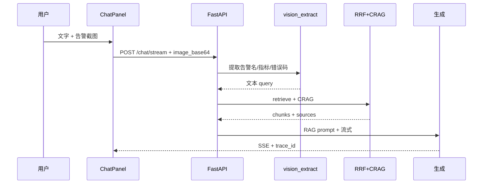

# M5 分步指南：工程化 + ShipLog 场景

> 前置：M4 全部完成（含 M4.4 trace_id）。  
> **业务场景**：M4 阶段为 DevKit 文档助手；**M5.2 起切换为 ShipLog On-call 助手**（见 [SCENARIO.md](../scenario/SCENARIO.md)）。  
> **M5 共四步**（M5.0～M5.3）；M5.3 完成后进入 [M6-steps.md](./M6-steps.md)（Agent + 简历交付）。

**当前进度：M5.3 代码已交付（PDF 热更新沿用 upload + 截图思路 A），待本地验收。**

---

## 总览


| 子步 | 做什么 | 改动范围 | 场景题重点 |
|------|--------|----------|-----------|
| M5.0 | Docker 一键启动 | `Dockerfile`、`docker-compose.yml` | 「怎么部署演示」 |
| M5.1 | **Chroma → pgvector** + trace 迁 PG | `store.py`、`trace.py`、Compose | 「为什么上 pgvector / trace 表怎么查」 |
| M5.2 | **ShipLog 场景定稿**：kb + eval + prompt/UI | `docs/kb/`、`import_docs.py`、prompt | 「On-call 为什么不能胡编命令」 |
| M5.3 | **On-call 输入亮点**：PDF 热更新 + 截图→文本→RAG | `vision.py`、ChatPanel | 「贴告警图怎么处理 / 为何不做 CLIP」 |

---

## M5.0 Docker Compose

**目标**：他人 `docker compose up` 能跑通上传 + 聊天 + eval（Chroma 数据卷挂载）。

### 要做的事

- 后端 `Dockerfile`（uv + `main.py`）
- `frontend/Dockerfile` + nginx 静态托管 + **API 反代**（`VITE_API_BASE_URL` 空 = 同源）
- `docker-compose.yml`：backend、frontend；挂载 `data/chroma`、`data/bm25`、`data/traces`
- `.env.example` 说明 `DEEPSEEK_API_KEY` 与 Docker 启动步骤

### 快速命令

```powershell
copy .env.example .env
# 编辑 .env 填入 DEEPSEEK_API_KEY
docker compose up --build
# 另开终端：首次入库
docker compose exec backend uv run python scripts/import_docs.py
```

浏览器：http://localhost:5173（API 同源反代）· 调试：`http://localhost:8032/health`

### 验收

- 新机器仅依赖 **Docker Desktop** + `.env` 能打开 UI 并 RAG 问答
- `GET /documents/stats` 正常

### 场景题

「本地开发和 Docker 部署差在哪？数据卷怎么挂？」

---

## M5.1 PostgreSQL：pgvector + trace

**目标**：向量与 trace 日志都进 **PostgreSQL**；**不大改**检索/CRAG/前端；BM25 仍用 `corpus.json`。

### 范围

| 要改 | 不改 |
|------|------|
| `app/rag/store.py`（`get_vector_store` → PGVector） | `retriever.py`（仍 `similarity_search`） |
| `app/rag/trace.py`（JSONL → PG 表，`trace_id` 索引） | `graph.py` / CRAG 流程 |
| `docker-compose.yml` 增加 **postgres** + pgvector 初始化 | 混合检索 RRF 逻辑 |
| `pyproject.toml` PG 依赖；`.env`：`DATABASE_URL` | 前端 |
| `GET /traces/{id}` 改为查 PG | 聊天历史 / users 表（**本步不做**） |

### PG 里存什么

```text
document_chunks（pgvector）：
  - page_content, embedding, metadata（source、chunk_id）

rag_traces：
  - trace_id（唯一索引）, question, steps（JSONB）, created_at, route, …
```

**不进 PG（本步）**：BM25 语料（仍 `data/bm25/corpus.json`）、chat 历史、users、incidents 表（**M6.0 再加**）。

### 验收

- `eval/run_eval.py` Recall@3 与 M4.3 Chroma 版 **持平**（记入 `eval/BASELINE.md`）
- `GET /traces/{trace_id}` 从 PG 回放，中文 question 正常
- `vector_count` / stats 接口仍可用

### 场景题

「为什么从 Chroma 迁到 pgvector？trace 为什么也进 PG？BM25 为什么还放 JSON？」

---

## M5.2 ShipLog 场景定稿（核心换皮）

**目标**：业务从 DevKit「查本仓库文档」→ **ShipLog「On-call 查 Runbook / 事故复盘」**；引擎不变，换知识库与叙事。

### 知识库结构（新建内容，非代码）

```text
docs/kb/
├── architecture/     # 服务拓扑、On-call 流程（1～2 篇）
├── runbooks/         # Redis 超时、Pod OOM、502、回滚等（5～6 篇）
└── postmortems/      # 虚构事故复盘（3～4 篇）
```

- 内容为**模拟场景**（参考公开 SRE 实践改写），非真实公司内部文档
- 主路径：`import_docs.py` 批量入库；**不依赖**用户上传才能 demo

### 代码改动（小）

| 文件 | 改动 |
|------|------|
| `scripts/import_docs.py` | 扫描 `docs/kb/**/*.md`，**不**索引 `docs/plan/PLAN.md` 等学习文档 |
| `app/rag/context.py` | Runbook 助手 prompt；强调**禁止编造 shell 命令** |
| `app/rag/graph.py` | `REWRITE_PROMPT` 改为 Runbook/Postmortem 语境 |
| `frontend/.../ChatPanel.tsx` | 标题 + 示例问题（如「Redis 超时第一步查什么？」） |
| `frontend/src/App.tsx` | 首页 ShipLog 文案 |
| `eval/questions.json` | 43 题（scored + abstain），`expected_sources` 指向 kb 文件 |

**不改**：`retriever.py`、`store.py`、`bm25_index.py`、`rag.py` 主链路。

### 验收

- `import_docs.py` 后问 Runbook 题 → 回答带正确 `sources`
- `eval/run_eval.py` 输出 ShipLog 版 Recall@3（记入 `eval/BASELINE.md`）
- CRAG 对「能否高峰 FLUSHALL」类危险题能拒答
- Docker 一键启动 + import 后可 demo

### 场景题

「混合检索为什么适合 Runbook（告警码、Pod 名、命令）？」「答错了怎么四层排查？」

---

## M5.3 On-call 输入亮点（PDF 热更新 + 截图 · 思路 A）

> **M5 最后一步**（原早期规划 M5.4，编号顺延为 M5.3）。完成后进入 M6。

**目标**：演示 **临时 PDF 手册** 与 **告警截图** 两种补充输入，均补充 M5.2 主库，不替代 eval 主路径。

> **不是端到端多模态 RAG**：图片不进向量库；embedding 仍用 bge 文本模型。

### 1）PDF 热更新

- 准备 1～2 份自写/改写 PDF（如《Redis 6.x 升级手册》）
- 沿用 `POST /upload` + `loader.py` PDF 切块
- Demo：问 Runbook 题 → 上传 PDF → 再问 PDF 内细节 → `sources` 出现 `.pdf`
- 样例放 `docs/kb/samples/`

### 2）截图提问 · 思路 A（DeepSeek V4）



| 层 | 改动 |
|----|------|
| `app/rag/vision.py`（新建） | `extract_query_from_image` |
| `app/schemas.py` | `ChatRequest.image_base64` 可选 |
| `app/llm.py` | 多模态 HumanMessage |
| `ChatPanel.tsx` | 贴图预览、base64 |
| `docs/kb/demo/` | 虚构告警截图 + 手测步骤 |

### 验收

- PDF 上传后能检索到 PDF chunk
- 贴 Redis 告警图 → 命中 `runbooks/redis-*.md`；trace 含 `vision_extract`
- 截图 2～3 道手测，不进主 `eval/questions.json`

### 场景题

「Runbook 怎么热更新？」「为什么不做 CLIP 图文混合检索？」

---

## 环境

| 软件 | M5.0～M5.2 | M5.3 |
|------|------------|------|
| **Docker Desktop** | ✅ 必须 | ✅ |
| **PostgreSQL 安装包** | ❌ | ❌ |
| **DeepSeek V4（截图）** | — | ✅ 同一 API Key |

---

## 与 M6 的衔接

| M5 交付 | M6 怎么用 |
|---------|-----------|
| `docs/kb/` + eval | M6.0 `search_runbook` tool |
| PG + trace | M6.0 `query_incident`、M6.2 checkpointer |
| M5.3 `vision.py` + PDF 上传 | M6.0 复用读图链路 |
| On-call prompt / CRAG | M6 Agent 图复用，不重写检索 |

---

## 下一步

说 **「继续 M5.3」** 做 PDF + 截图（M5 最后一步）。  
M5.3 验收后 → **「继续 M6.0」** → 见 [M6-steps.md](./M6-steps.md)。
