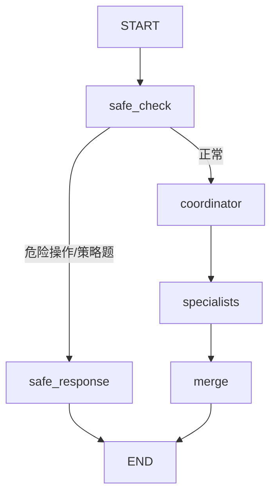
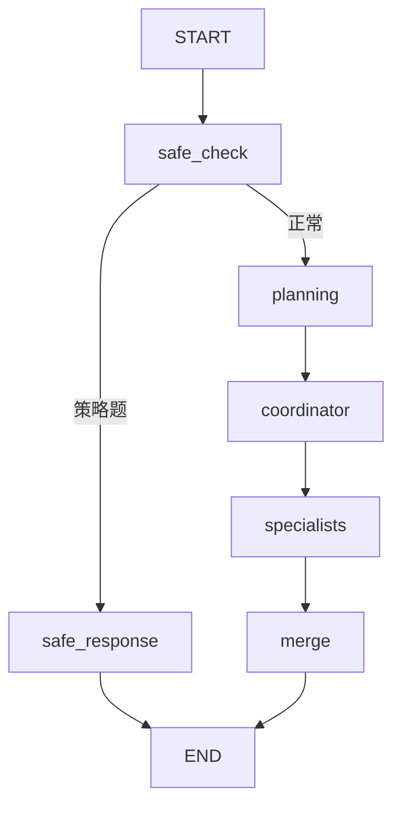

# M6 分步指南：Agent 演进 + 交付收尾

> **前置**：M5 全部完成（M5.0～M5.3，含 PDF/截图）。  
> **目标**：ShipLog On-call **Agent** 能力 + README/PITCH/面试自测。  
> M4/M5 的 CRAG 仍负责**检索质量**；M6.0～M6.2 负责 **Agent**；M6.3～M6.4 负责 **简历交付**。

**当前进度：M6.0～M6.2 已验收（含 M6.2 补充 generate 多轮）；分支 `feature/m6-agent`。**

---

## 总览


| 子步 | 做什么 | 改动范围 | 场景题重点 |
|------|--------|----------|-----------|
| M6.0 | Tool Calling | `tools.py`、`graph.py`、SSE | 「Runbook vs 事故库 vs 拓扑」 |
| M6.1 | Multi-Agent 分工 | LangGraph 多 Agent + 安全分支 | 「多路结果冲突怎么汇总」 |
| M6.2 | 会话记忆 + 多步规划 | checkpointer、planning node | 「会话记忆 vs 知识库」 |
| M6.3 | README 简历化 + `PITCH.md` | `README.md`、`docs/PITCH.md` | 「3 分钟介绍 ShipLog」 |
| M6.4 | 场景面试 20 题自测 | `qa-m5.md` / `qa-m6.md` | 场景题 ≥15/20 |

> **编号说明**（原 M5 后半并入 M6）：  
> - 原 **M5.4** → 现 **M5.3**（PDF + 截图，M5 最后一步）  
> - 原 **M5.3** → 现 **M6.3**（README + PITCH）  
> - 原 **M5.5** → 现 **M6.4**（面试自测）

---

## M6.0 Tool Calling：On-call 三工具

**目标**：LLM 根据问题自主选工具——查 Runbook、查历史事故、或查**服务依赖拓扑**（不做联网搜索）。

> **已定稿（2026-07）**：第三工具为 `get_service_topology`，数据来自 `docs/kb/architecture/service-topology.md`（可 seed PG 小表）。不做 `web_search`。

### 工具定义（`app/tools.py`）

| 工具 | 作用 | 对应能力 |
|------|------|----------|
| `search_runbook` | 混合检索 `docs/kb/` Runbook/复盘（语义+关键词） | M4.3 RRF + CRAG |
| `query_incident` | SQL 查 PG `incidents` 历史事故 | M5.1 PG |
| `get_service_topology` | 按服务名返回上下游依赖、端口、关键中间件 | `docs/kb/architecture/service-topology.md` |

**三工具分工（面试可背）**：

| 用户意图 | 选哪个 tool |
|----------|-------------|
| 「怎么排查 / 第一步做什么」 | `search_runbook` |
| 「以前出过吗 / 上次事故根因」 | `query_incident` |
| 「还影响了谁 / 依赖谁 / blast radius」 | `get_service_topology` |

### `incidents` 表（M6.0 新增 seed）

```text
incidents：
  - id, title, service, severity, root_cause, resolved_at, summary, …
```

- seed 3～5 条与 `docs/kb/postmortems/` 一致的虚构数据

### `service_topology`（M6.0 新增，与 kb 对齐）

- 来源：`docs/kb/architecture/service-topology.md` 中的服务清单与依赖关系
- 实现：PG 表 `service_topology` 或启动时解析 md/json seed（二选一，M6.0 子步内定）
- 返回示例字段：`service`, `depends_on[]`, `depended_by[]`, `ports`, `datastores[]`

### 要做的事

- `tools.py`：上述三工具 + Pydantic 参数校验 + JSON 解析兜底（重试 1 次）
- `graph.py`：LangGraph tool calling 节点（agent → tool → 汇总 → 生成）
- `trace`：steps 记录 `tool_name`、入参、摘要结果
- 前端（可选）：SSE `tool_start` / `tool_end`
- 复用 M5.3 `vision.py`：贴图后可先读图再 `search_runbook` 或 `get_service_topology`

### 验收

- 「Redis 超时第一步？」→ `search_runbook`
- 「上个月 OOM 出过吗？」→ `query_incident`
- 「order-service 502 还可能影响谁？」→ `get_service_topology`（含 payment-service 等）
- `GET /traces/{id}` 可回放选了哪个 tool

### 场景题

- 「怎么保证 JSON tool 调用稳定？选错 tool 怎么办？」
- 「Runbook 检索和拓扑查询为什么拆成两个 tool？」

---

## M6.1 Multi-Agent：On-call 分工

**目标**：复杂故障由协调 Agent 拆分——查 Runbook、查历史、查拓扑；危险操作走**安全策略回答**（非空白拒答）。

### Agent 分工

| Agent | 职责 |
|-------|------|
| **协调 Agent** | 解析问题 → JSON 派单 → 指定专家与参数 |
| **Runbook 专家** | `search_runbook`（RRF + CRAG） |
| **Incident 专家** | `query_incident` + 复盘摘要 |
| **Topology 专家** | `get_service_topology` 上下游依赖 |

### LangGraph 流程



### 安全分支（safe_response）

- 检测 FLUSHALL、删库等 → **safe_response 节点**
- **明确答「不能/禁止」** + Runbook 依据 + 审批提醒 + 替代方案
- **不**输出危险命令步骤；**不**空白拒答
- 历史复盘题（含「事故/复盘/怎么发生」）**不走**安全分支，正常派 incident 专家

### 验收

- 「order-service 502 影响谁？」→ trace 含 `agent_dispatch` + 多路 `agent_result` + `agent_merge`
- 「生产 Redis 能 FLUSHALL 吗？」→ trace 含 `safe_check.route=safe_response` + `safe_response.policy=true`；回答明确禁止
- 「Redis FLUSHALL 事故怎么发生的？」→ **不走** safe_response，走 coordinator + incident

### 场景题

「Multi-Agent 结果冲突怎么办？」

---

## M6.2 On-call 记忆与多步规划

**目标**：多轮 On-call 对话 + 复杂故障分步排查。

### 实现要点（M6.2 已编码）

| 模块 | 作用 |
|------|------|
| `app/rag/checkpointer.py` | `AsyncPostgresSaver` 连接 PG，启动时 `setup()` |
| `app/rag/session.py` | `record_thread_turn`；**补充** `load_thread_history` / `resolve_thread_id` |
| `app/llm.py` | **补充** `_build_chat_messages`（generate 多轮 history） |
| `multi_agent_graph.py` | `planning` 节点；`thread_id` checkpointer；每轮 `Overwrite` 重置 ephemeral 状态 |
| `schemas` / `main` | `thread_id`、`plan_steps`；SSE 先推 `plan_steps` 再推 token |
| `frontend` | `localStorage` thread_id；气泡内排查计划；「新会话」；**`chatStorage.ts` 刷新恢复 UI** |

### LangGraph 流程（正常路径）



### 要做的事

- [x] LangGraph **checkpointer**（PostgresSaver）
- [x] **Planning node**：拆 2～4 步排查计划
- [x] 前端：步骤列表 + SSE `plan_steps`
- [x] 前端：**localStorage 聊天气泡缓存**（刷新后 UI 恢复，方案 A）
- [x] **补充**：generate 层多轮（后端 `turn_history`，关 RAG 纯 LLM 也续聊）

### 验收

- 「刚才那个告警」能指代上一轮问题（同 `thread_id` 第二轮）
- 复杂题 trace/UI 可见 `planning.plan_steps`
- 点「新会话」换 thread_id 后指代失效（预期）
- **F5 刷新**后同 thread 聊天气泡仍在（plan_steps / sources / trace 保留；截图预览不保留）

### 场景题

「Agent 记忆和 RAG 知识库区别？」→ 见 [qa-m6.md](../qa/qa-m6.md) M6.2 章节。

---

## M6.2 补充 · generate 层多轮（后端存 history）

**目标**：**关 RAG = 纯 LLM**，但仍按 `thread_id` 从 checkpointer 读 `turn_history`，最终 generate 能看到最近几轮；**开 RAG** 时 generate 同样拼 history（Agent 推理记忆与生成记忆统一数据源）。

### 实现要点

| 模块 | 作用 |
|------|------|
| `session.py` | `load_thread_history` / `resolve_thread_id`；`record_thread_turn` 开/关 RAG 均调用 |
| `llm.py` | `_build_chat_messages`：System + 历史 Human/AI + 当前 Human |
| `main.py` | 关 RAG：`chat`/`chat_stream` 带 history；流式统一 `record_thread_turn` |
| `rag.py` | 最终 `chat(..., history=...)` 再 record |

### 记忆窗口

- `MAX_TURN_HISTORY = 6` 条（约 3 轮 Q&A），超出 **滑动丢弃最旧**（`trim_turn_history`）
- 前端仍只发 `thread_id` + `message`；localStorage 仅 UI 展示

### 验收

- **关知识库**：「北京天气」→「东城区」能接上上一轮语境（同 thread_id）
- **开知识库**：多轮 generate 不只有 Agent enrich，最终 LLM 也带 history
- 第 4 轮后最早一轮从 checkpointer 消失（预期）

### 场景题

「UI 有历史但模型接不上怎么办？」→ 见 [qa-m6.md](../qa/qa-m6.md) M6.2 补充。

---

## M6.3 README 简历化 + PITCH

> 原规划 **M5.3**。M6.0～M6.2 完成后写，叙事覆盖 **RAG → CRAG → PDF/截图 → Agent** 全链路。

**目标**：GitHub 首页当简历项目；3 分钟 STAR 讲 ShipLog。

### 进度

- [x] `docs/PITCH.md`：背景 → 方案 → 指标 → 难点（3 分钟口述稿）
- [ ] `README.md` 简历化（**延后**，用户确认后再做）
- [ ] 更新 [SCENARIO.md](../scenario/SCENARIO.md) 与 README 链到 PITCH/eval

### 要做的事（README 延后项）

- README：场景、架构图、技术栈、Docker/PG 启动、eval 数字 + Agent 亮点
- 链到 `eval/BASELINE.md`、`docs/PITCH.md`

### 验收

- [x] 能不看稿讲完全链路（PITCH）
- [ ] 外人只看 README 知道解决什么问题、怎么跑（待 README）

### 场景题

「用 3 分钟介绍你的 RAG/Agent 项目。」→ 见 [PITCH.md](../PITCH.md)

---

## M6.4 场景面试 20 题

> 原规划 **M5.5**。紧接 PITCH。

**目标**：按 [qa-scenario-guide.md](../qa/qa-scenario-guide.md) + 面经库自测；**14 场景 + 6 八股**。

### 进度

- [x] `docs/qa/qa-m6.md` §M6.4：20 题完整参考答案（含美团/火山引擎类八股）
- [ ] 用户自测勾选 ≥15/20

### 覆盖范围

- RAG/eval、CRAG、PDF/截图、Tool Calling、Multi-Agent、记忆、Docker 排障
- 八股：混合检索、overlap、Agentic RAG、ReAct、LangGraph、JSON tool 兜底

### 验收

- 自测 **≥15/20** 题
- 能白板画：用户问 → Agent 选 tool → 检索/CRAG → 生成 + trace

---

## 与 M5.3 截图的衔接

| 能力 | M5.3 | M6 |
|------|------|-----|
| `vision.py` 读图 → query | ✅ | M6.0 复用 |
| 文本 RRF + CRAG | ✅ | `search_runbook` tool |
| SSE 读图/工具步骤 | 可选 | `vision_extract` / `tool_start` |

---

## 不做 / 延后

| 项 | 说明 |
|----|------|
| CLIP / 端到端多模态向量 | backlog U-009 |
| MCP 协议 | backlog U-005 |

---

## 下一步

先完成 **M5.3**（PDF + 截图）→ 说 **「继续 M6.0」**。  
M6.2 后 → **M6.3** README → **M6.4** 面试自测。
